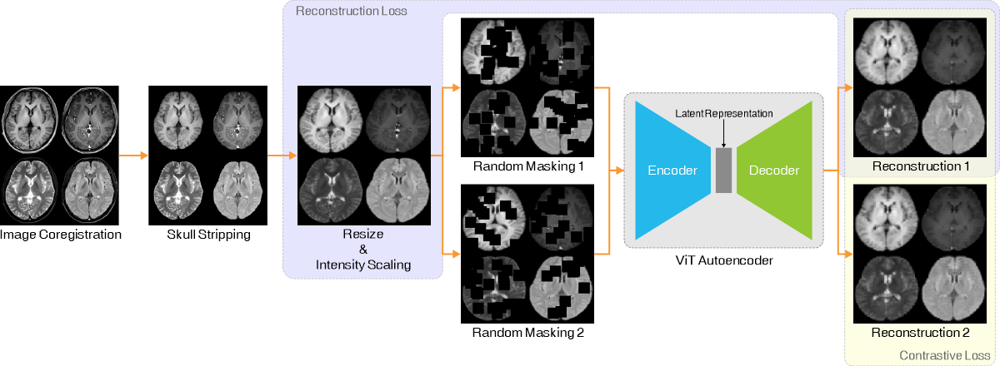
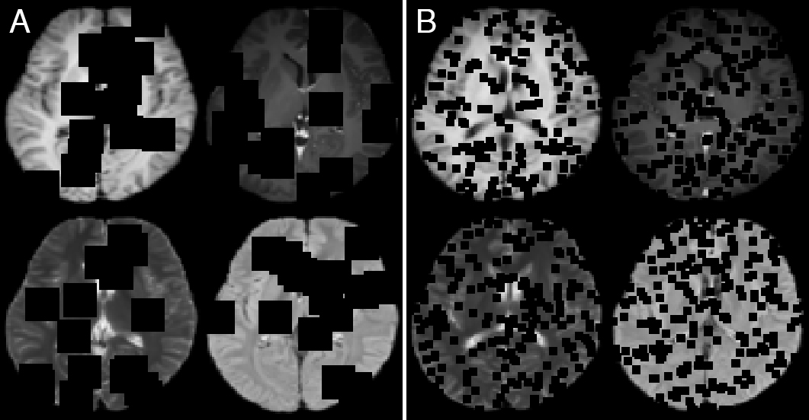

# Large Medical Image Foundation Model (LaMIM)
## Model Overview
This repository provides self-supervised pre-trained vision transformer autoencoder (ViTAutoEnc) for multi-contrast brain MRI. The training process is illustrated below

Two mask schemes are used: mask block size 16*16*16 with 86 blocks (A); mask block size 4*4*4 with 6000 blocks (B)


## How to use

### Installing Dependencies
Dependencies can be installed using:
``` bash
pip install -r requirements.txt
```

### Download pretrained models
We provide the self-supervised pre-trained weights in [SSL_ViT_Block16](https://drive.google.com/file/d/1x1VI-0AoMqQZYVcbNoTQxe5ac-t3Ia5R/view?usp=drive_link) and [SSL_ViT-Block4](https://drive.google.com/file/d/1ttHL3IeZwuhjLPKS6SeLYjRQW-p6dD1U/view?usp=drive_link). Download and place them into the **Pretrained_models** folder.

### Data Prepare
1. Convert DICOM in NIFTI. [dcm2niix](https://github.com/rordenlab/dcm2niix) is recommended.
2. Skull striping. Choose T1 weight or enhanced T1w volume with higher resolutin for skull stripping. [HD-BET](https://github.com/MIC-DKFZ/HD-BET) is recommended. 
3. Remove redudant blank area using ExtractRegionFromImageByMask from [ANTs](https://github.com/ANTsX/ANTs).
4. Co-registrer other contrast, eg T2w and FLAIR, to T1w or T1c. The multiply the brain mask generated in previous step.
5. Merge the co-registered and skull stripped volume into 4D volume by the order of T1w, T1c, T2w and FLAIR.

### Fine tune the weights on downstream task
1. Modify ```train_files``` and ```val_files``` in finetune_train.py to point the preprocessed train and validation images, and run finetune_train.py
2. Modify ```test_files``` in finetune_test.py to point the preprocessed test images, and run finetune_test.py to evaluate downstream model.
3. It is possible to modify Model.py to test more classifier configurations.

## Pre-train from scratch with own data
### For Pre-training
1. Pull the MONAI docker image
`docker pull projectmonai/monai`
2. Run run_docker.sh
3. Run run_pretraining.sh insider docker
